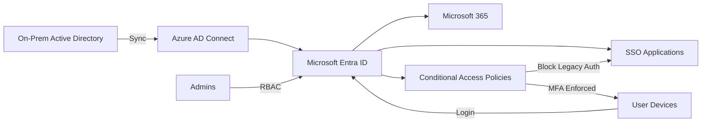

# Enterprise Identity Architecture (Hybrid AD + Entra ID)

## Overview
This project outlines a scalable enterprise identity architecture supporting hybrid Active Directory and Microsoft Entra ID environments across multi-site organizations.

Designed for environments with:
- 500–2000+ users
- Multiple physical sites
- Hybrid cloud/on-prem infrastructure
- Security-first identity strategy

## Core Components
- Active Directory (on-prem)
- Microsoft Entra ID (Azure AD)
- Azure AD Connect
- Conditional Access Policies
- SSO integrations (SAML/OAuth)

## Architecture Design
- Hybrid identity with synchronized accounts
- Role-based access control (RBAC)
- Least privilege enforcement
- MFA and Conditional Access enforcement

## Security Model
Aligned with:
- CIS Controls
- NIST 800-53 principles
- Zero Trust Architecture

## Conditional Access Strategy
- Require MFA for all remote access
- Block legacy authentication
- Device compliance enforcement
- Risk-based sign-in policies

## Identity Lifecycle Management
- Automated provisioning/deprovisioning
- Group-based licensing
- Role-based group assignments

## Business Impact
- Improved security posture across distributed sites
- Reduced identity-related incidents
- Scalable identity framework for growth

## Architecture Diagram

